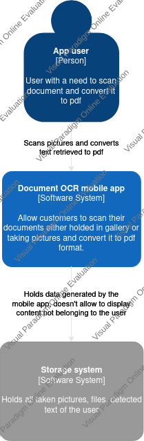
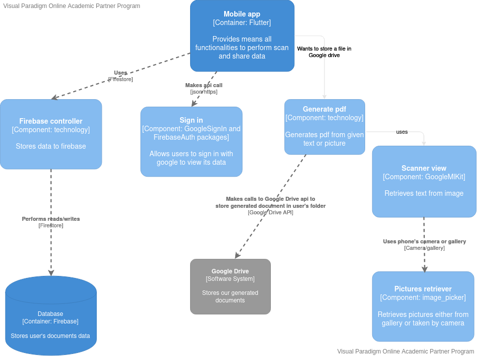
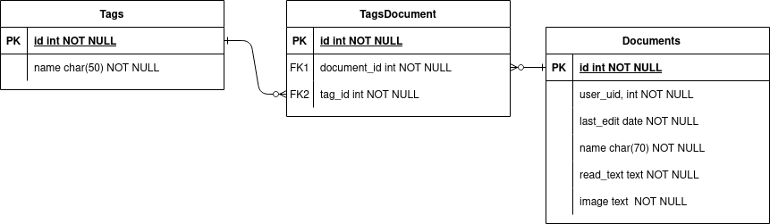
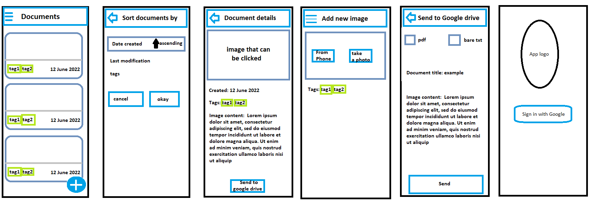

# Documents OCR  

## Table of contents

- [Overview](#overview)
- [Requirements](#requirements)
- [Diagrams](#diagrams)
- [Mockups](#mockups)
- [License](#license)
## Overview
 
Documents OCR (Optical Character Recognition) allows you to to scan documents via smartphone's camera and  convert it into pdf or text file format. You can later add it to your google drive.  

## Requirements

App will be written in Flutter framework so you it will run either on Android or IOs device 

## Diagrams
### C1 Diagram

### C3 diagram

### Diagram ERD

ERD diagram is mostly to somehow visualize how our data will be structurized. There is no need to hold in db more data about user than uiid because all the auth stuff is getting cared of by Firebase.

## Milestones 

- [x] Take or load photos and retrieve data from them.
- [x] Login through Google account and connect with Firebase, where images, texts will be stored.
- [x] Export data to Google Drive
- [ ] All views are working.

## Mockups 

Mockups for the app were done in the most professional graphical editor that ever existed. Being serious, it was made to give us some insights what kind of product we are aiming.  

## License

Distributed under the MIT License. See [LICENSE](LICENSE) for more information.
